# Contributing to Triad Workflow

> 这个 repo 是 **Triad Workflow 框架** 的独立开发地，于 2026-04-18 从 `tripplemay/aigcgateway` 分离（见 [aigcgateway 16b58d9](https://github.com/tripplemay/aigcgateway/commit/16b58d9)）。

---

## 本 repo 的角色

| 角色 | 内容 |
|---|---|
| **这个 repo (`harness-template`)** | Triad Workflow 框架的 **源码**（规则文件、模板、脚本、文档、SVG）。所有修改在这里发生。 |
| **aigcgateway** | 框架的 **最大用户 + dogfooding 项目**。在它里面发现新经验 → 提案写到它的 `.auto-memory/proposed-learnings.md` → done 阶段由 Planner 同步到本 repo |
| **未来其他项目** | `npx degit tripplemay/harness-template my-project` + `bash bootstrap.sh`（新项目）或 `bootstrap-adopt.sh`（已有项目） |

---

## 分支策略

- `main`：发布分支，保持可用
- feature 分支（可选）：大改动先起分支，合并前 squash

本 repo 通常改动较小（补规则、加文档、修脚本），单人维护时直接在 `main` 开发+push 也可以接受。多人协作时建议 PR 流程。

---

## Commit 消息规范

沿用 conventional commits 前缀：

| 前缀 | 含义 | 示例 |
|---|---|---|
| `feat(framework):` | 新功能（新规则、新脚本、新文档） | `feat(framework): add Planner rule X` |
| `fix(framework):` | 修 bug | `fix(framework): bootstrap.sh on macOS zsh` |
| `docs(framework):` | 只改文档 | `docs(framework): clarify adoption step 5` |
| `refactor(framework):` | 重构（改名、重组） | `refactor(framework): rename Cowork → Triad` |
| `chore(framework):` | 杂项（版本号、README 小修） | `chore(framework): bump version to v0.9.1` |

所有涉及"框架能力变化"的 commit（feat/fix/refactor）必须：
1. 更新 `CHANGELOG.md` 增加版本条目
2. 在 commit body 解释来源批次 + 触发原因

---

## 版本号策略（SemVer-ish）

版本号形式：`vMAJOR.MINOR.PATCH`

| 变化类型 | 升哪个位 | 举例 |
|---|---|---|
| **破坏性改动**（修改状态机、删除铁律、改文件路径约定） | MAJOR | v0.x → v1.0 |
| **新增能力**（新铁律、新脚本、新文档、新 SVG） | MINOR | v0.8 → v0.9 |
| **bug 修复、文档微调、typo** | PATCH | v0.9.0 → v0.9.1 |

当前处于 `0.x` 阶段，MAJOR=0 表示"尚未第一个稳定版"。MINOR 大改动仍可发生。到 v1.0 之后 MAJOR 才严格锁定。

---

## 发布流程

每次打版本号：

1. 在 `CHANGELOG.md` 新增 `## vX.Y.Z — YYYY-MM-DD（一句话副标题）` 条目，包含：
   - **来源批次：** 哪个批次发现 / 哪个外部反馈触发
   - **触发原因：** 为什么要改
   - **变更内容：** 具体改了什么文件、什么内容
   - **影响范围：** 对已经接入的项目有无迁移成本
2. commit：`chore(framework): release vX.Y.Z — 副标题`
3. push 到 main
4. 打 git tag：`git tag vX.Y.Z && git push origin vX.Y.Z`
5. （可选）在 GitHub 写 release notes

---

## 从 aigcgateway 同步经验（最常见的贡献路径）

aigcgateway 在实际运行 Triad Workflow 时踩到的坑、想到的改进，会通过下面流程回流到本 repo：

```mermaid
flowchart LR
    A["aigcgateway 批次中<br/>发现新经验"] --> B["追加到 aigcgateway<br/>.auto-memory/proposed-learnings.md"]
    B --> C["aigcgateway batch done 阶段<br/>Planner 与用户逐条确认"]
    C --> D["确认的条目：<br/>cd ~/project/harness-template"]
    D --> E["编辑对应 .md（harness/ 或 docs/）"]
    E --> F["更新 CHANGELOG.md 加新版本条目"]
    F --> G["commit + push 到 main"]
    G --> H["打 tag（如 vX.Y.Z）"]
    H --> I["aigcgateway 已同步条目<br/>从 .auto-memory/proposed-learnings.md 移除"]
```



这个路径保证：
- 框架演进有来源（不是凭空加规则）
- aigcgateway 的 `.auto-memory/proposed-learnings.md` 始终是"待处理"而非"历史记录"
- 本 repo 的 `CHANGELOG.md` 完整记录每条规则的来龙去脉

---

## 外部贡献

欢迎：

- **Bug 报告**：开 GitHub Issue，描述复现步骤
- **新的铁律 / 规则建议**：开 Issue，说明来源场景
- **文档改进、typo 修复**：直接提 PR
- **新的 bootstrap 场景支持**（比如 monorepo、Bun 项目）：Issue 讨论后再 PR

不接受：

- 改变 Triad Workflow 核心原则（三角色分离、无自评、状态机驱动）的 PR —— 这是框架的身份
- 功能性的"炫技"（比如改用 Rust 重写 bootstrap）—— 保持 shell 脚本以最大化兼容性

---

## 本地开发

```bash
git clone https://github.com/tripplemay/harness-template.git
cd harness-template

# 改完之后测试 bootstrap.sh（会在当前目录创建一堆文件，注意用临时目录测）
mkdir /tmp/test-triad && cd /tmp/test-triad
bash /path/to/harness-template/bootstrap.sh

# 测试 bootstrap-adopt.sh（模拟接入现有项目）
mkdir /tmp/test-adopt && cd /tmp/test-adopt
git init && echo "existing content" > CLAUDE.md && git add . && git commit -m "init"
bash /path/to/harness-template/bootstrap-adopt.sh  # 需要先 cp .triad-src 过来，或修改脚本路径逻辑
```

---

## 问答

### Q1: 为什么 aigcgateway 分离后还有 `harness-rules.md` / `planner.md` 等文件？

那些是 aigcgateway 作为 Triad Workflow 用户的**运行时副本**（项目根目录），相当于"我在用这套规则"的固化快照。框架升级不会自动传播到 aigcgateway，需要手工同步（`cp` 对应版本的文件过去）。

### Q2: 为什么不用 git submodule？

submodule 对单人开发者来说过度工程：
- 每次 clone 要加 `--recursive`
- 有独立的 HEAD，容易混乱
- 本 repo 的改动频率低（几天到几周一次），不需要实时同步

对框架用户来说，`npx degit` 一次性拉取的体验更简单直接。

### Q3: aigcgateway 的 framework 历史在哪？

通过 `git subtree push` 在过去几个月持续推送到本 repo main，历史完整保留。查看：
```bash
git log --oneline
```
能看到从 v0.1.0 到 v0.9.0 的所有变更。

---

## 联系

- GitHub Issues: https://github.com/tripplemay/harness-template/issues
- Author: tripple (tripplezhou@gmail.com)
