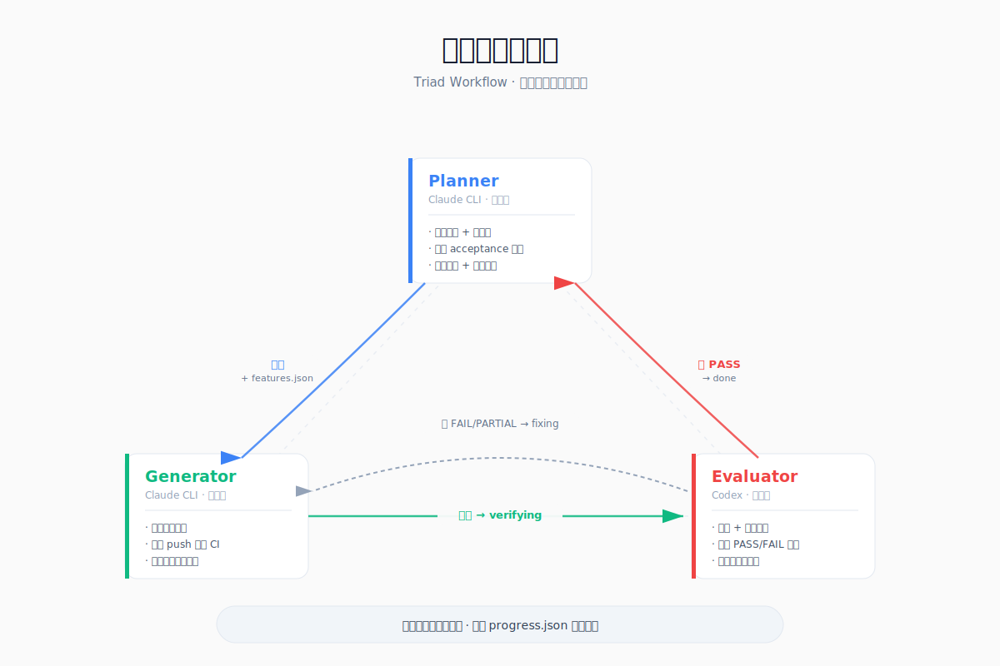
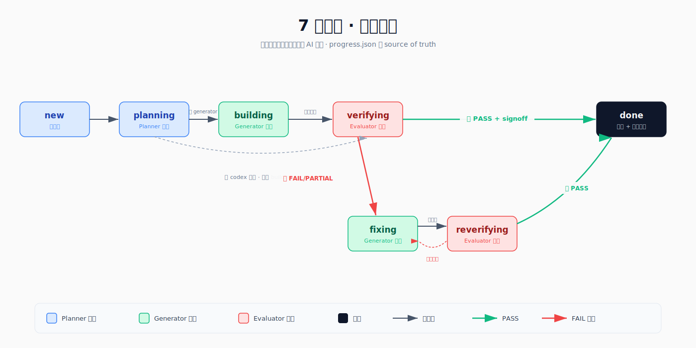

# Triad Workflow

> **三角色 · 状态机 · 无自评** —— Claude CLI + Codex 协同开发的工程化框架

沉淀自 AIGC Gateway 项目完整实施过程。适用于任何使用 Claude CLI（Claude Code）+ Codex 或类似多 agent 配合开发的项目。

---

## 一图看懂





---

## 核心特征

- **三角色不重叠**：Planner（规划）/ Generator（实现）/ Evaluator（验收），没有任何 agent 评估自己的工作
- **状态机驱动**：7 状态 `new → planning → building → verifying → fixing ⟷ reverifying → done`，阶段推进由 `progress.json` 决定
- **Git 作为协作总线**：agent 间不直接通信，通过状态文件 + `.auto-memory/` 异步交接，可跨机器、跨工具、跨会话
- **记忆分层沉淀**：T0/T1/T2 共享记忆 + framework 自迭代，经验跨项目复用

---

## 30 秒快速开始

```bash
npx degit tripplemay/harness-template my-new-project
cd my-new-project && bash bootstrap.sh
# 启动 Claude CLI："按 INIT.md 初始化项目"
```

详细见 [开箱即用手册](docs/03-quickstart.md)。

---

## 文档导航

| 文档 | 给谁看 | 内容 |
|---|---|---|
| 📘 [01 · 功能介绍](docs/01-concepts.md) | 想了解"这是什么、解决什么问题、为什么这么设计" | 三角色 / 状态机 / 记忆分层 / 设计哲学 / 适用场景 |
| 📗 [02 · 使用方法](docs/02-usage.md) | 已经初始化完，想了解"具体怎么跑" | 一次完整批次详解 / 角色职责 / 关键文件 / 高级用法 |
| 📙 [03 · 开箱即用手册](docs/03-quickstart.md) | "我要现在就跑起来" | 前置条件 / 3 步初始化 / 第一个批次实战 / FAQ |
| 📕 [CHANGELOG](CHANGELOG.md) | 想看版本演进 | 每次迭代的变更内容、来源批次、触发原因 |

---

> **历史说明：** 早期版本曾命名为 "Cowork + Harness"（Cowork = Claude Desktop 作为 Planner），v0.7.0 改名为 Triad Workflow 以更准确反映三角色协作的本质。部分文件名（`harness-rules.md` 等）保留历史名以维持向后兼容。

---

## 框架由什么组成

```
framework/
├── bootstrap.sh            # 一键初始化脚本（机械复制 + 目录建立）
├── INIT.md                 # Claude CLI 初始化引导 prompt（智能填占位符）
├── README.md               # 本文件（同时作为 template repo GitHub 落地页）
├── CHANGELOG.md            # 框架版本变更记录
├── proposed-learnings.md   # 待沉淀提案（done 阶段处理）
├── archive/                # 已闭环提案归档
├── harness/                # 状态机核心（7 状态：new→planning→building→verifying→fixing⟷reverifying→done）
│   ├── harness-rules.md    # 状态机规则
│   ├── planner.md          # Planner 角色指令
│   ├── generator.md        # Generator 角色指令
│   ├── evaluator.md        # Evaluator 角色指令
│   └── progress.init.json  # 初始 progress.json
├── memory/                 # 跨会话记忆系统模板（v0.5.0 分层加载）
│   ├── MEMORY.md           # 记忆索引（T0/T1/T2 分层）
│   ├── project-status.md   # T0：项目状态快照（覆盖写，≤30 行）
│   ├── environment.md      # T0：环境信息（生产地址、服务器、测试账号）
│   ├── role-context/       # T1：角色行为规范（按当前角色加载）
│   │   ├── planner.md
│   │   ├── generator.md
│   │   └── evaluator.md
│   ├── user-role.md        # T2：用户角色和工作偏好
│   └── reference-docs.md   # T2：文档结构索引
└── templates/              # 项目级配置模板
    ├── CLAUDE.md           # Claude 项目指令模板（占位符版本）
    ├── AGENTS.md           # Codex 指令模板（占位符版本）
    ├── signoff-report.md   # 功能签收报告模板
    └── features.template.json  # features.json 模板（含 executor 字段）
```

### 文档分层设计

主文件（CLAUDE.md / AGENTS.md）只放**每次启动必读**的内容，详细规则按需加载：

```
项目根目录/
├── CLAUDE.md               # ~70 行：启动流程 + Commands + 子文档索引
├── AGENTS.md               # ~100 行：角色定义 + 核心规则 + 子文档索引
├── harness-rules.md        # 状态机规则（始终加载）
├── planner.md / generator.md / evaluator.md  # 角色文件（按阶段加载）
├── progress.json / features.json / backlog.json  # 状态机数据
├── .agent-id / .agents-registry  # agent 身份与注册表
├── .auto-memory/           # 共享记忆（git-tracked）
└── docs/dev/               # 按需加载的参考文档
```

**原则：** agent 启动时加载量越少，信息焦点越清晰。架构详情、策略矩阵、报告模板等只在需要时才读取。

---

## 新项目启动（3 步）

### 第 1 步：从 template repo 拉取骨架

```bash
npx degit tripplemay/harness-template my-new-project
cd my-new-project
```

### 第 2 步：运行 bootstrap 脚本

```bash
bash bootstrap.sh
```

脚本会自动：
- 把 harness 角色文件（`harness-rules.md` / `planner.md` / `generator.md` / `evaluator.md`）放到项目根
- 从 `memory/` 初始化 `.auto-memory/`（含 T0/T1/T2 分层文件）
- 从 `templates/` 初始化 `CLAUDE.md` / `AGENTS.md`（占位符版本）
- 创建 `progress.json` / `features.json` / `backlog.json` 初始文件
- 创建 `docs/specs/` / `docs/test-cases/` / `docs/test-reports/user_report/` / `docs/dev/` 目录骨架
- 配置 `.gitignore`（`.agent-id` 等）
- 把 template 源文件规整到 `framework/` 子目录（供后续沉淀回流）
- 把 `INIT.md` 留在根目录，方便 Claude CLI 找到

### 第 3 步：用 Claude CLI 填占位符

打开 Claude CLI（在项目目录），说：

> "按 INIT.md 初始化项目"

Claude 会：
- 交互式问 6 个问题（项目名、技术栈、常用命令、生产地址、agent 身份、用户偏好）
- 展示填充计划，等你确认
- 自动填好 `CLAUDE.md` / `AGENTS.md` / `.auto-memory/*` 所有占位符
- 创建 `.agent-id` 写入本机身份
- 首次 `git init` + commit
- 删除一次性工件 `INIT.md`

完成后，第一个 Harness 批次可以直接开始：说"根据 harness 规则，开发 [第一个需求]"，Claude CLI 进入 Planner 模式。

`.agents-registry` 会在第一次启动时自动创建（harness-rules.md §1.2 自动注册）。

---

### 备选：手工初始化（不使用 Claude）

也可以跳过 INIT.md，手动编辑带占位符的文件：

| 文件 | 占位符 |
|---|---|
| `CLAUDE.md` | 项目名、Tech Stack、Commands |
| `AGENTS.md` | `PRODUCTION_STAGE` / `PRODUCTION_DB_WRITE` / `HIGH_COST_OPS` |
| `.auto-memory/user-role.md` | 用户身份和偏好 |
| `.auto-memory/environment.md` | 生产 URL、SSH、测试账号 |
| `.auto-memory/project-status.md` | 初始批次状态 |

手动创建 `.agent-id`：

```bash
cat > .agent-id <<EOF
cli: [本机 CLI agent 名]
codex: [本机 Codex agent 名]
EOF
```

---

## 日常使用流程

### 开启新需求批次

1. 将 `progress.json` 的 `status` 改为 `"new"`
2. 启动 Claude CLI："根据 harness 规则，开发 [需求描述]"
3. Claude CLI 进入 Planner 模式：
   - 读取 `docs/test-reports/user_report/` + `backlog.json`
   - 与用户确认本批次包含哪些功能
   - 写规格文档（新功能批次硬性要求），生成 features.json
   - 读 `.agents-registry` 与用户确认角色分配
   - 判断批次类型，设 status 为 `building`（含 generator 任务）或 `verifying`（Codex-only）

### 开发中（Generator）

- Claude CLI 读取 `progress.json` → status `building` → Generator 模式
- 每完成一个功能：更新 progress.json + push + **检查 CI（铁律）**
- CI 红色 → 立即停止新功能，先修复 CI
- 上下文不足 20% → 保存进度，告知用户重启
- 所有 `executor:generator` 完成 → status 改为 `verifying`

### 验收（Evaluator）

- Codex 读取 status `verifying` → Evaluator 模式
- **设计并编写测试**（测试域所有权归 Evaluator）
- **执行 `executor:codex` 功能**，产出报告
- 逐条验证所有功能，输出 PASS / PARTIAL / FAIL → `evaluator_feedback`
- 有问题 → `fixing`；全 PASS → 写 signoff → `done`

### 修复（Generator → Evaluator 复验）

- Claude CLI 读取 `fixing` → 针对 evaluator_feedback 修复
- **回归测试硬性要求**：critical/high 修复必须同 commit 补 regression test
- 修复完成 → `reverifying`，fix_rounds +1
- Codex 复验，全 PASS → `done`

### 会话结束（所有角色通用）

每次会话结束前：
1. **5a.** 检查 project-status.md 是否需要更新（覆盖写，≤30 行），有变更则 commit + push
2. **5b.** 在 progress.json 的 `session_notes.[myId]` 写本会话叙事性上下文

---

## 测试分层约定（L1 / L2）

| 层级 | 环境 | 依赖 | 职责 |
|---|---|---|---|
| L1 | 本地 | 无外部依赖（mock/stub） | auth 逻辑、路由、格式、协议合规 |
| L2 | Staging | 真实外部服务（API Key） | 全链路调用、计费、端对端写入 |

**铁律：** L1 FAIL ≠ 产品 Bug。L2 测试需用户明确授权才执行。
acceptance 中带 [L1] / [L2] 标注的项，按层级处理。

---

## 记忆系统约定（v0.5.0 分层加载）

`.auto-memory/` 目录纳入 git，作为跨设备、跨会话的"项目记忆"。**确定性加载，不再"按需"。**

| 层级 | 何时加载 | 文件 | 大小限制 |
|---|---|---|---|
| **T0** | 每次启动必读 | `MEMORY.md` + `project-status.md` + `environment.md` | 各 ≤30 行 |
| **T1** | 按当前角色加载 | `role-context/{当前角色}.md` | ≤50 行 |
| **T2** | MEMORY.md 索引标注触发条件命中时 | `feedback-*.md` / `reference-*.md` / `user-role.md` | 按需 |

**写入职责：**

| 文件 | 谁写 | 规则 |
|---|---|---|
| `project-status.md` | 所有角色 | 谁产生变更谁更新，**覆盖写**（不追加） |
| `environment.md` | Planner | 环境变更由 Planner 统一维护 |
| `role-context/*.md` | Planner | 行为规范由 Planner 统一制定 |
| `session_notes`（progress.json） | 各写各的 | 会话结束时覆盖写自己的条目 |
| `feedback-*.md` / `reference-*.md` | 所有角色 | 谁发现谁写 |

**内容边界铁律：**
- `project-status.md` = WHAT（会变的事实）
- `role-context/*.md` = HOW（不常变的规范）
- 每条信息只存一处，不重复 progress.json 已有的结构化数据

---

## 需求池（backlog.json）

独立于当前批次的需求暂存区。

- **Claude CLI 在任意阶段** 与用户确认需求后，若有正在执行的批次，写入 `backlog.json` 而非打断
- **Planner 在新批次 status=new 时** 必读 backlog.json，与用户确认本批次包含哪些
- 选中的并入 features.json 并从 backlog 移除，未选保留

**条目格式：** `{ id, title, description, decisions[], confirmed_at, priority, order? }`

`order` 字段用于大型多批次重构时的串行执行（Path A 模式）。

---

## 角色动态分配（role_assignments）

支持在 `progress.json` 中按批次指定角色，覆盖默认映射：

```json
{
  "role_assignments": {
    "planner": "Mark",
    "generator": "Kimi",
    "evaluator": "Reviewer"
  }
}
```

**约束：**
- generator ≠ evaluator
- Codex 类只能担任 evaluator（当前阶段方向 B）
- done 阶段清除 role_assignments

---

## 签收报告约定

每个完整批次交付时，在 `docs/test-reports/` 创建一份签收报告：

```
docs/test-reports/[批次名称]-signoff-YYYY-MM-DD.md
```

使用 `framework/templates/signoff-report.md` 模板。`progress.json.docs.signoff` 为空不得置 done。

---

## 经验教训（来自 AIGC Gateway 项目）

### Harness 纪律
- Claude CLI 做规划（Planner）和实现（Generator），Codex 做测试设计 + 执行 + 验收（Evaluator）— 职责不混淆
- Planner 不得直接修改产品代码，即使是紧急修复也必须走流程（铁律第 9 条）
- evaluator_feedback 中的 PARTIAL 必须修复并写明可量化的验收条件
- **CI 红色不得继续开发新功能**（每次 push 后 `gh run list` 检查，铁律）
- **修复 critical/high 必须同 commit 补 regression test**（acceptance 的一部分，Evaluator 验收时检查）

### UI 工程化（设计系统先行）
- 新项目第一个批次必须是设计系统（颜色 token、排版、基础组件、公共 hook、布局框架），不是第一个业务页面
- 有原型 ≠ 有设计系统。原型解决"页面长什么样"，设计系统解决"所有页面怎么一致地长成这样"
- 给 AI agent 的 spec 必须指定"用什么组件实现"，不能只说"做成什么样"
- 第一个页面完成后做组件审计：有无硬编码颜色、内联样式、重复逻辑。有则先抽组件再做第二个页面
- 来源：AIGC Gateway P1 按原型逐页实现后，R1~R2 又花 3 个批次（28 个功能）重构对齐设计系统

### 设计稿一致性（无条件适用）
- Generator 修改有设计稿的页面时，不得改变布局结构，除非 Planner 明确标注「布局变更」
- Evaluator 验收有设计稿页面时必须做视觉一致性检查，无论 acceptance 是否提及
- 移除区块允许，但不得用自创布局填充

### 大型重构编排（Path A 模式）
- 多批次串行重构时，在 backlog.json 用 `order` 字段标顺序，project-status.md 维护路线图概览
- 生产部署版本 vs HEAD 可能不同步，project-status.md 应同时记录两者的 short-sha

### 成本控制
- 聚合型服务商必须设白名单，否则同步全量模型导致健康检查成本爆炸
- 图片生成的健康检查止步于 L2（格式验证），不执行 L3（真实生成），单次 $0.04–$0.19 不值得
- 聚合型服务商的图片生成能力不可信赖，应优先使用直连 Provider
- doc-enricher 类工具需按 modality 过滤，图片模型不需要 AI 丰富化

### Sync Adapter
- 每个 SyncAdapter 必须实现 `filterModel`，白名单是模型暴露的最高优先级控制
- 遗漏 filterModel 会导致白名单收紧后旧模型残留 DB

### Schema 变更
- 每个 migration 只包含一个功能的变更，不要打包
- `@updatedAt` 字段 migration 必须手动补 `DEFAULT now()`，Prisma 不自动加
- Schema 变更 + migration + 引用代码必须同一 commit

### 跨设备协作
- `.auto-memory/` 必须纳入 git，每次会话结束 commit + push
- `.agent-id` 不入 git（每台机器本机身份）
- 启动第一步必 `git pull --ff-only origin main`，避免读到旧状态
