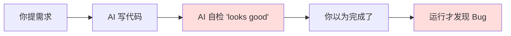
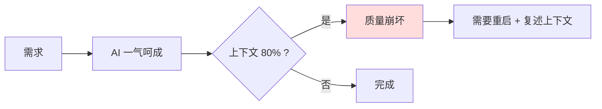
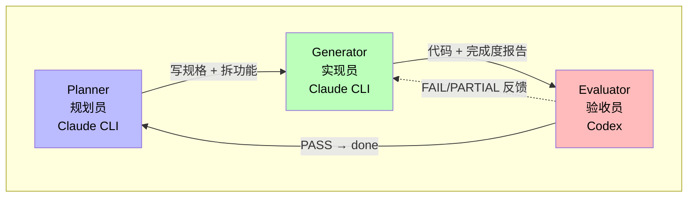
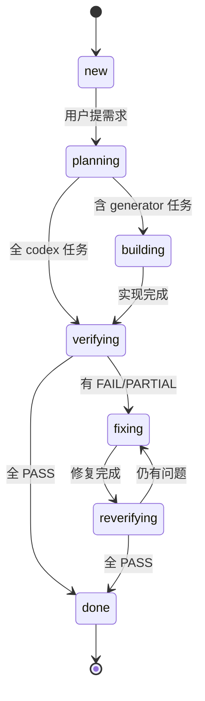
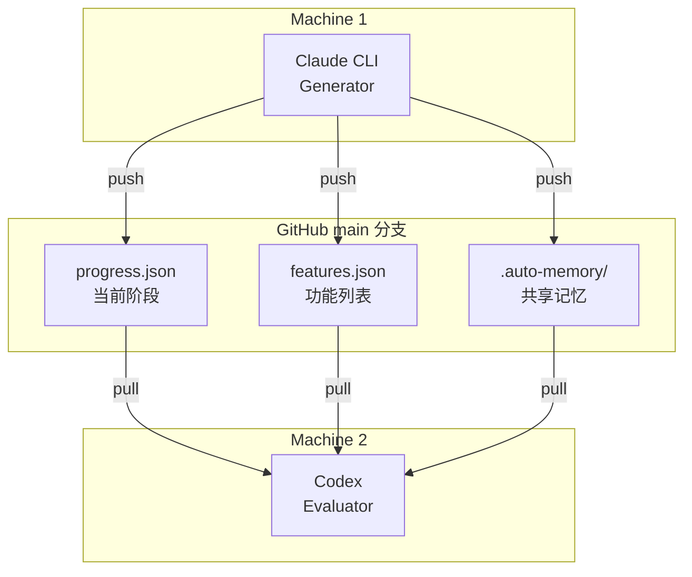
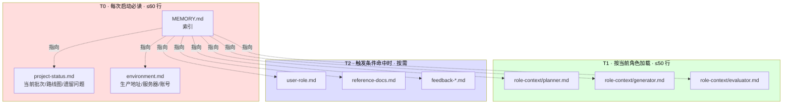

# 01 · 功能介绍 — Triad Workflow 是什么

> 给"想了解这是什么、解决什么问题、为什么这么设计"的读者。
> 阅读时间约 15 分钟。

---

## TL;DR

**Triad Workflow 是一个让多个 AI Agent（Claude CLI + Codex 等）协同完成软件开发批次的状态机框架。** 它通过三角色严格分离 + Git 文件作为协作总线 + 分层共享记忆，解决了"AI 自评不可靠"、"多轮交互易丢失上下文"、"多 agent 并发协作易冲突"三个核心问题。

---

## 1. 它解决什么问题

### 痛点 1：AI 评估自己写的代码 = 不可靠

直接用 Claude / Cursor / Copilot 写代码，存在一个隐性矛盾：

**根因：** 写代码的人和验收代码的人是同一个，没有独立视角。AI 的"自检"只是"重新读一遍并说没问题"，无法发现自己的盲点。

### 痛点 2：长任务上下文窗口爆炸

一个完整批次可能涉及 5-30 个功能。如果让一个 AI 一气呵成做完，要么：
- 上下文不足被迫中断，重启后丢失之前的决策
- 强行压缩上下文，导致后期质量下降

### 痛点 3：多 Agent 协作没有"接头暗号"

如果手动让 Claude 做 A，让 Codex 做 B，让另一台机器的 Agent 做 C —— 谁先做、做什么、做到哪一步，全靠口头协调。结果是：
- 重复工作（两个 agent 同时改同一个文件）
- 工作丢失（A 改完没告诉 B，B 基于旧版做）
- 没有审计（出问题不知道是谁的锅）

---

## 2. Triad Workflow 怎么解决这三个问题

### 解法 1：三角色严格分离（无自评）

| 角色 | 工具 | 职责 | 不做的事 |
|---|---|---|---|
| **Planner** | Claude CLI | 拆需求、写规格、定 acceptance、安排批次 | 不直接改产品代码 |
| **Generator** | Claude CLI | 实现功能代码 | 不写测试、不评估自己的实现 |
| **Evaluator** | Codex | 设计测试 + 执行测试 + 验收 + 写签收报告 | 不写产品代码、不修复 bug |

**关键铁律：generator ≠ evaluator**。Codex 的视角独立于 Claude CLI，能捕获 Generator 漏掉的边界情况。

### 解法 2：状态机分阶段，每阶段独立会话

**每个状态对应一个独立的 AI 会话**：
- `planning` 阶段开一个 Planner 会话写规格，结束
- `building` 阶段开一个 Generator 会话实现，按功能逐条完成，需要时分多次会话
- `verifying` 阶段开一个 Evaluator 会话验收，结束

每个会话只关心自己阶段的事，上下文焦点清晰，不需要承载整个批次的所有信息。**状态文件 `progress.json` 才是 source of truth，会话只是执行者。**

### 解法 3：Git 文件作为协作总线

**Agent 之间不直接通信**，通过 git 仓库异步交接：

| 文件 | 作用 |
|---|---|
| `progress.json` | 当前 status、阶段进度、evaluator 反馈、session_notes |
| `features.json` | 功能列表、每条 acceptance 标准、executor 类型、状态 |
| `backlog.json` | 待处理需求池（独立于当前批次） |
| `.auto-memory/` | 跨会话共享记忆（项目状态、环境、角色行为规范） |
| `.agent-id` | 本机 agent 身份（不入 git，每台机器独立） |
| `.agents-registry` | 项目所有已知 agent 列表 |

**好处：**
- 跨机器：Agent 在不同地方运行，靠 git 同步状态
- 跨工具：Claude CLI 和 Codex 用同一份 progress.json
- 跨时间：会话中断重启不丢上下文，新会话读 progress.json 即可恢复
- 有审计：git log 是天然的协作记录

---

## 3. 记忆分层（T0/T1/T2）

随着项目演进，记忆会越积越多。如果每次会话都加载全部，上下文很快爆炸。Triad Workflow 用分层加载解决：

**写入职责（避免冲突）：**

| 文件 | 谁写 | 规则 |
|---|---|---|
| `project-status.md` | 所有角色 | 谁产生变更谁更新，**覆盖写**（不追加），≤30 行 |
| `environment.md` | Planner | 环境变更由 Planner 统一维护 |
| `role-context/*.md` | Planner | 行为规范由 Planner 统一制定 |
| `feedback-*.md` | 所有角色 | 谁发现谁写 |

**内容边界铁律：**
- `project-status.md` = WHAT（会变的事实，如"当前批次 BL-XXX 在 verifying"）
- `role-context/*.md` = HOW（不常变的规范，如"修复 critical 时必须同 commit 补 regression test"）
- 每条信息只存一处

---

## 4. 设计哲学（铁律的来源）

Triad Workflow 的所有"铁律"都来自真实事故。以下是几个典型例子：

### 铁律：Generator 不评估自己的代码（铁律第 4 条）

**起源事故：** 早期实验中让 Claude 既写代码又写测试，结果 Claude 倾向于让测试"过得去"而非"严格"，多个 bug 通过了"自测"但生产挂了。

**结论：** 测试设计 + 执行 + 验收，全部归 Evaluator（Codex）。Generator 不写任何测试。

### 铁律：Planner 不直接修改产品代码，即使是 hotfix（铁律第 9 条）

**起源事故：** 生产登录故障时，Planner 直接改了 4 个源文件并推送，绕过流程。事后发现修复方案有问题，但因为没经过 Generator + Evaluator 的双重视角，问题被引入新一轮。

**结论：** 任何代码改动必须走 Planner（分析） → Generator（实现） → Evaluator（验收）的完整流程，hotfix 也不例外。

### 铁律：CI 红色不得继续开发新功能

**起源事故：** Generator 实现 F-001 push 后 CI 挂了但继续做 F-002，等 F-005 时发现 F-001 的 lint 错误已经污染了基础工具函数，需要回滚 5 步重做。

**结论：** 每次 push 后必须 `gh run list` 检查；CI 红色立即停止新功能，先修复 CI。

### 铁律：spec 涉及具体代码细节时必须 Read 源码核实

**起源事故：** Planner 写 spec 时把 `deduct_balance` 函数签名记错了（2 参 vs 实际 6 参），Generator 开工前规格核查捕获，避免了重复 transaction 记录破坏对账的事故。

**结论：** 函数签名/API/schema/常量这类技术细节，Planner 写 spec 前必须 Read 源码确认；Code Review 报告的事实性断言按"线索"对待，不按"真相"采信，需源码 + 生产数据双路验证。

> **设计哲学总结：** 每条铁律都是"踩过的坑变成的护栏"。框架不是凭空设计的最佳实践，而是从实践中沉淀出来的"哪些事必须避免"。详见 [CHANGELOG](../CHANGELOG.md) 看每个版本的演进背景。

---

## 5. 什么场景适合用 Triad Workflow

### 适用 ✓

- **多 AI agent 协作的项目**：Claude CLI + Codex / Claude Desktop + GitHub Copilot 等组合
- **长周期、批次性开发**：项目持续 1 个月+、按周/按双周做批次迭代
- **跨设备工作**：在台式机 + 笔记本之间切换，需要状态同步
- **质量敏感**：生产环境、付费用户、计费逻辑等"出错代价高"的场景
- **学习沉淀有价值**：希望积累"哪些坑要避免"的知识资产

### 不适用 ✗

- **一次性脚本**：写个 bash 脚本、改个 README，杀鸡用牛刀
- **个人原型 / Hackathon**：48 小时冲刺，流程开销大于收益
- **纯前端样式调整**：迭代极快，状态机反而拖慢
- **没有 Codex 或第二个独立 agent**：失去"第三方验收"，沦为单人流程
- **强 SaaS 集成场景**：如果工具链强制走 Linear/Jira/PR review，状态机会和它们打架

---

## 6. 与其他模式的对比

| 维度 | 普通 AI 编程 | Triad Workflow | 传统 Scrum/Agile |
|---|---|---|---|
| 评估责任 | AI 自评 | 独立 agent 验收 | 人工 PR review |
| 状态管理 | 对话历史 | 状态机文件 | Jira/Linear |
| 协作方式 | 单线对话 | Git 异步 | 会议同步 |
| 上下文 | 易爆炸 | 分阶段独立 | N/A |
| 沉淀机制 | 无 | proposed-learnings → CHANGELOG | retrospective |
| 适合规模 | 小特性 | 5-30 功能/批次 | 跨团队大项目 |

---

## 7. 下一步

读完概念，建议按以下顺序：

- 想立刻动手 → [03 · 开箱即用手册](03-quickstart.md)
- 想了解每个文件、每个状态、每个角色的具体操作 → [02 · 使用方法](02-usage.md)
- 想看每个版本的演进 → [CHANGELOG](../CHANGELOG.md)
