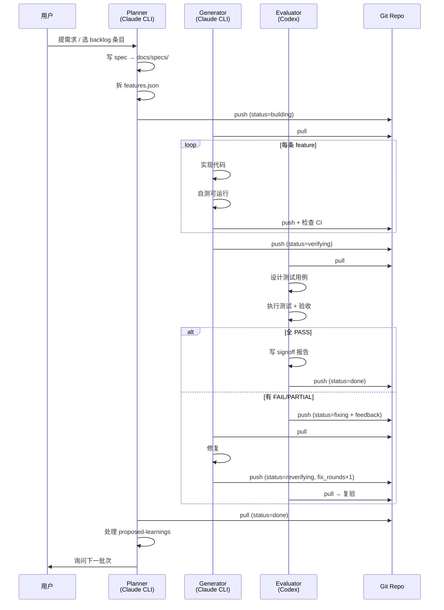
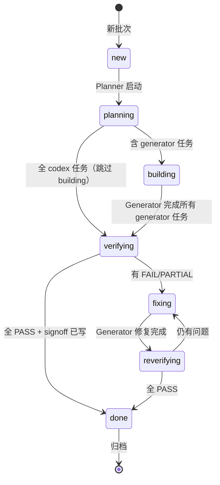
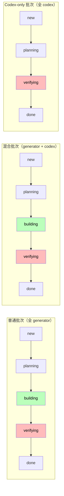
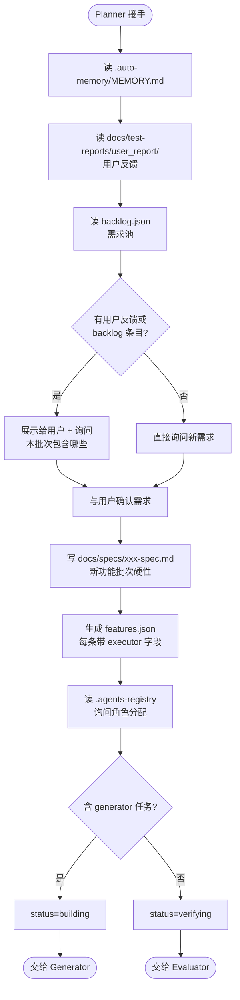
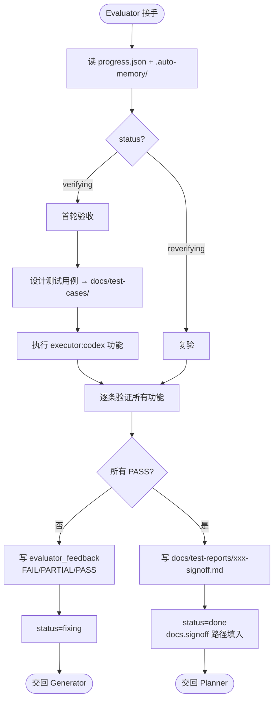
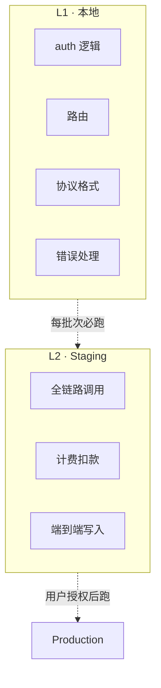
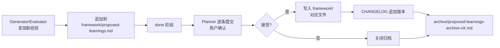
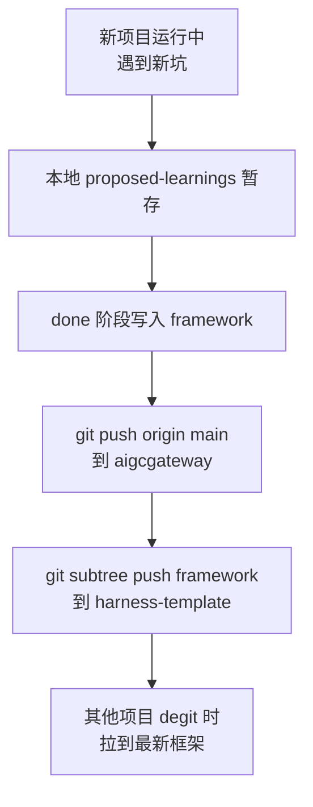

# 02 · 使用方法详解

> 给"已经初始化完，想了解具体怎么跑"的读者。
> 阅读时间约 25 分钟。前置：建议先读 [01 · 功能介绍](01-concepts.md)。

---

## 目录

- [一次完整批次的全流程](#一次完整批次的全流程)
- [状态机详解](#状态机详解)
- [三角色职责详解](#三角色职责详解)
- [关键文件详解](#关键文件详解)
- [高级用法](#高级用法)
- [沉淀机制](#沉淀机制)

---

## 一次完整批次的全流程

下图展示 1 个典型批次从需求提出到归档的完整链路：



**关键点：**
- 每个角色只在自己的阶段活跃，其他阶段静默
- 所有交接通过 git，agent 之间不直接通信
- 用户在 Planner 的 `planning` 和 `done` 阶段被请示，其他阶段不打扰

---

## 状态机详解

### 7 个状态



### 每个状态做什么

| status | 谁在做 | 做什么 | 退出条件 |
|---|---|---|---|
| `new` | Planner | 拆需求、写 spec | 写完 features.json |
| `planning` | Planner | 同上（中断后续接） | 同上 |
| `building` | Generator | 按 features.json 逐条实现 | 所有 `executor:generator` 完成 |
| `verifying` | Evaluator | 设计测试 + 执行 codex 任务 + 验收 | 输出 evaluator_feedback |
| `fixing` | Generator | 根据 evaluator_feedback 修复 | 修复完成 |
| `reverifying` | Evaluator | 复验，写 signoff | 全 PASS + signoff 文件就绪 |
| `done` | Planner | 处理 learnings、清 role_assignments、问下一批次 | 用户确认 |

### 批次类型与跳转规则



**Planner 在 planning 末尾判断：**
- features.json 中存在 `executor:generator` → status = `building`
- features.json 全部 `executor:codex` → status = `verifying`（跳过 building）

**典型 codex-only 批次场景：** 压力测试执行、code review、安全审计、E2E 测试运行 —— 这类任务交付的是"报告"而非代码。

---

## 三角色职责详解

### Planner（Claude CLI）



**Planner 的输出：**
- `docs/specs/[批次名]-spec.md`：规格文档（新功能批次硬性，bug 修复可省略）
- `features.json`：功能列表（每条含 id、title、acceptance、executor、status）
- `progress.json`：status 切换 + role_assignments

**Planner 的铁律：**
- 不直接修改产品代码，即使是 hotfix
- spec 涉及具体代码细节时必须 Read 源码核实
- Code Review 报告的事实性断言按"线索"对待，不按"真相"采信

### Generator（Claude CLI）

```mermaid
flowchart TD
    Start([Generator 接手]) --> S0[读 progress.json]
    S0 --> S1{status?}
    S1 -->|building| Build[按 features.json 逐条实现]
    S1 -->|fixing| Fix[读 evaluator_feedback<br/>针对 FAIL/PARTIAL 修复]
    Build --> S2[实现一个功能]
    Fix --> S2
    S2 --> S3[自测可运行]
    S3 --> S4[更新 features.json + progress.json]
    S4 --> S5[git push origin main]
    S5 --> S6[gh run list<br/>检查 CI]
    S6 --> S7{CI 状态?}
    S7 -->|success| S8{还有 pending?}
    S7 -->|failure| Fix CI[立即停止新功能<br/>修复 CI]
    S7 -->|in_progress| Wait[等待完成]
    Wait --> S6
    Fix CI --> S5
    S8 -->|是| S2
    S8 -->|否，building| Done1[status=verifying]
    S8 -->|否，fixing| Done2[status=reverifying<br/>fix_rounds +1]
    Done1 --> End([交给 Evaluator])
    Done2 --> End
```

**Generator 的输出：**
- 产品代码（src/、scripts/ 等）
- progress.json + features.json 状态更新
- 每次 push 后必查 CI

**Generator 的铁律：**
- 不写任何测试代码（测试域归 Evaluator）
- 上下文剩余 < 20% 立即保存进度结束会话
- CI 红色不得继续新功能，必须先修复
- 修复 critical/high 时必须同 commit 补 regression test

### Evaluator（Codex）



**Evaluator 的输出：**
- 测试用例文档（`docs/test-cases/`，可选）
- 测试代码（如 `scripts/test-mcp.ts`、单元测试等）
- 测试执行报告（`docs/audits/`、`docs/test-reports/`）
- 签收报告（`docs/test-reports/[批次名]-signoff-YYYY-MM-DD.md`，硬性）

**Evaluator 的铁律：**
- 不修改任何产品代码（src/、prisma/、配置文件）
- L1 FAIL ≠ 产品 Bug（本地用 placeholder 调外部 API 必然失败）
- L2 测试需用户明确授权才执行
- signoff 文件不存在不得置 done

---

## 关键文件详解

### progress.json — 状态机心脏

```json
{
  "status": "verifying",
  "user_goal": "BL-SEC-AUTH-SESSION — JWT HttpOnly cookie + middleware 验签",
  "total_features": 4,
  "completed_features": 3,
  "fix_rounds": 0,
  "current_sprint": "BL-SEC-AUTH-SESSION",
  "last_updated": "2026-04-18T02:40:00Z",
  "reference_docs": [
    "docs/specs/BL-SEC-AUTH-SESSION-spec.md"
  ],
  "role_assignments": {
    "planner": "Mark",
    "generator": "Kimi",
    "evaluator": "Reviewer"
  },
  "docs": {
    "spec": "docs/specs/BL-SEC-AUTH-SESSION-spec.md",
    "test_cases": null,
    "signoff": null,
    "framework_reviewed": false
  },
  "evaluator_feedback": null,
  "generator_handoff": null,
  "session_notes": {
    "Kimi": "本会话叙事性上下文：完成 F-AS-01/02/03，等 Codex F-AS-04 验收 16 条...",
    "Reviewer": null
  }
}
```

| 字段 | 谁写 | 用途 |
|---|---|---|
| `status` | 谁推进谁写 | 当前阶段 |
| `user_goal` | Planner | 一句话目标 |
| `total_features` / `completed_features` | Generator | 进度 |
| `fix_rounds` | Generator（fixing→reverifying 时 +1） | 修复轮次 |
| `role_assignments` | Planner | 本批次角色分配 |
| `docs.spec` / `docs.signoff` | Planner / Evaluator | 关键产物路径 |
| `evaluator_feedback` | Evaluator | FAIL/PARTIAL 详情 |
| `generator_handoff` | Generator | 给 Codex 的执行说明 |
| `session_notes` | 各角色各写各的 | 跨会话叙事上下文 |

### features.json — 功能清单

```json
{
  "sprint": "BL-SEC-AUTH-SESSION",
  "features": [
    {
      "id": "F-AS-01",
      "title": "新增 session-cookie.ts 工具函数",
      "priority": "high",
      "executor": "generator",
      "status": "completed",
      "acceptance": "setSessionCookie / clearSessionCookie 可正确设置 HttpOnly cookie，prod 加 Secure 标志"
    },
    {
      "id": "F-AS-04",
      "title": "执行 16 条安全验收清单",
      "priority": "high",
      "executor": "codex",
      "status": "pending",
      "acceptance": "所有 16 条验收项 PASS，签收报告生成"
    }
  ]
}
```

**executor 字段决定该 feature 由谁处理：**
- `"generator"`：代码实现类，Claude CLI 在 building 阶段做
- `"codex"`：执行/评估类，Codex 在 verifying 阶段做

### backlog.json — 需求池

```json
[
  {
    "id": "BL-105",
    "title": "支持自定义模板分类",
    "description": "用户希望能给模板打多级标签",
    "decisions": ["三级层级", "颜色区分"],
    "confirmed_at": "2026-04-15",
    "priority": "medium",
    "order": 7
  }
]
```

**用法：**
- Claude CLI 在任何阶段与用户确认了新需求，但当前批次未结束 → 写入 backlog.json
- Planner 在新批次启动（status=new）时必读 backlog.json，与用户确认本批次包含哪些
- `order` 字段用于大型多批次串行重构（Path A 模式）的执行顺序

### .auto-memory/ — 共享记忆

```
.auto-memory/
├── MEMORY.md                  # T0 索引
├── project-status.md          # T0 当前状态快照（覆盖写，≤30 行）
├── environment.md             # T0 生产/Staging 环境
├── role-context/              # T1 角色行为规范
│   ├── planner.md
│   ├── generator.md
│   └── evaluator.md
├── user-role.md               # T2 用户偏好（按需）
└── reference-docs.md          # T2 文档结构索引（按需）
```

加载规则见 [01 · 记忆分层](01-concepts.md#3-记忆分层t0t1t2)。

### .agent-id 和 .agents-registry

**`.agent-id`**（不入 git，每台机器独立）：
```
cli: Kimi
codex: Reviewer
```

**`.agents-registry`**（入 git，全项目共享）：
```
cli:
  - Kimi
  - Mark
  - Richard
codex:
  - Reviewer
  - Sammi
```

agent 启动时检查 `.agent-id` 中的 myId 是否在 registry，不在则自动追加 + commit + push。

---

## 高级用法

### 多 Agent 协作（role_assignments）

当多人/多机器/多 agent 同时在同一项目工作时，每个批次可在 progress.json 显式指定角色：

```json
{
  "role_assignments": {
    "planner": "Mark",
    "generator": "Kimi",
    "evaluator": "Reviewer"
  }
}
```

**约束规则：**
- generator ≠ evaluator（不能自评）
- Codex 类 agent 只能担任 evaluator（当前阶段方向 B）
- planner 可与任何角色重叠

**适用场景：**
- 跨机器：A 机器配 `cli: Mark`，B 机器配 `cli: Kimi`，role_assignments 指定谁做哪部分
- 同机器多实例：harness 无法区分，由用户在对话中口头指定

### Codex-only 批次

当一整个批次都是"产出报告"类任务时，跳过 building 直接进 verifying：

```json
// features.json 全部 executor:codex
{
  "features": [
    {"id": "F1", "title": "执行 1000 并发压测", "executor": "codex", ...},
    {"id": "F2", "title": "对 src/api/ 做 code review", "executor": "codex", ...}
  ]
}
```

Planner 在 planning 末尾自动判断：全 codex → status=verifying。

### Path A 大型重构编排

当有 10-20 个相互依赖的批次需要串行执行（如安全加固重构、UI 全量翻新）时：

1. Planner 与用户讨论后，在 `backlog.json` 用 `order` 字段标顺序：
   ```json
   [
     {"id": "BL-201", "title": "认证加固", "order": 1, ...},
     {"id": "BL-202", "title": "授权加固", "order": 2, ...},
     ...
   ]
   ```
2. `.auto-memory/project-status.md` 维护路线图概览：
   ```
   ## Path A 路线图（14 批次）
   - P0 安全：CRED-HARDEN ✅ → AUTH-SESSION ✅ → BILLING-AI ← / INFRA-GUARD
   - P1 数据：DATA-CONSISTENCY / INFRA-RESILIENCE
   ```
3. 每批次 done 后，Planner 启动下一批次时按 order 选取

### 测试分层 L1/L2



**铁律：**
- L1 FAIL ≠ 产品 Bug（本地常用 placeholder key/mock，调外部必然失败）
- L2 必须用户明确授权
- acceptance 中带 `[L1]` / `[L2]` 标注的项按层级处理

---

## 沉淀机制

Triad Workflow 的"自迭代"能力来自两个机制：

### 机制 1：proposed-learnings → CHANGELOG



**写入示例（`framework/proposed-learnings.md`）：**

```markdown
## [2026-04-18] Planner — 来源：BL-SEC-BILLING-AI spec 编写偏差

**类型：** 铁律补充

**内容：** Planner 写 spec 时若涉及函数签名等代码细节，必须先 Read 文件核实，
不得只凭 code-review 报告或记忆推断。

**建议写入：** `framework/harness/planner.md` 新增"spec 编写前核查清单"

**状态：** 待确认
```

Planner 在 done 阶段读取此文件，逐条问用户："这条沉淀进框架吗？" 确认后写入对应文件 + 在 CHANGELOG 加新版本。

### 机制 2：跨项目复用

`framework/` 目录是 source of truth：
- aigcgateway 项目内迭代演进
- 通过 `git subtree push --prefix=framework template-origin main` 同步到独立 template repo
- 新项目 `npx degit tripplemay/harness-template` 拉取最新框架

**沉淀流程示意：**



---

## 下一步

- 想立刻动手 → [03 · 开箱即用手册](03-quickstart.md)
- 想了解 Triad Workflow 设计动机 → [01 · 功能介绍](01-concepts.md)
- 想看每个版本的演进 → [CHANGELOG](../CHANGELOG.md)
