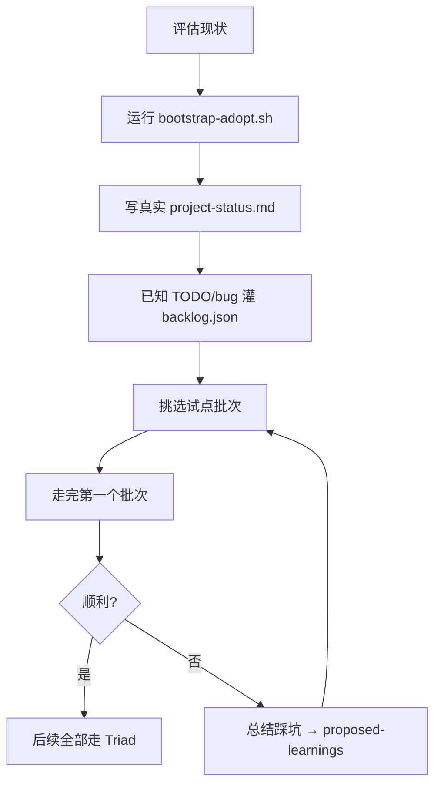

# 04 · 接入现有项目

> 给"已经研发到一半的项目"的读者。
> 前置：建议先读 [01 · 功能介绍](01-concepts.md) 了解 Triad Workflow 的价值主张。
> 阅读 + 执行约 60-90 分钟（含写 project-status.md 和挑试点批次）。

---

## 和 greenfield 启动的关键差异

[03 · 开箱即用手册](03-quickstart.md) 适用于新建项目：`bootstrap.sh` 会铺好所有文件。但现有项目已经有 `CLAUDE.md` / `.gitignore` / `docs/` / `README.md`，直接跑 `bootstrap.sh` 会覆盖它们。

这里要走 **非破坏性接入** —— 保留所有现有内容，只补充 Triad 必需的文件。

---

## 3 种落地路径

| 路径 | 做法 | 适用 | 风险 |
|---|---|---|---|
| **A · 并行双轨** | 只加 Triad 必需文件，现有 CLAUDE.md / docs 完全不动。新开发走 Triad，旧开发继续传统方式 | 想小范围试水、不影响团队 | 两套流程并行易混乱，最多 1-2 周要收敛 |
| **B · 渐进接管** ⭐ | 评估→非破坏性接入→写真实 project-status→已知 TODO 灌 backlog→挑试点批次→全员切换 | 大部分情况 | 第一批次慢 2-3 倍（磨合期） |
| **C · 冷启动重建** | 完全按 greenfield bootstrap 走，先备份再还原 | 项目极早期、CLAUDE.md 还空 | 破坏性大、工作量大 |

**本文聚焦路径 B（渐进接管）**，也是 `bootstrap-adopt.sh` 的设计目标。

---

## 整体流程



总耗时约 60-90 分钟（首次接入），之后新批次按正常 Triad 节奏走。

---

## 具体 8 步落地清单

### 第 1 步：评估现状（10 分钟）

盘点现有内容，心里有数：

| 要看 | 为什么 |
|---|---|
| `CLAUDE.md` 内容（如有） | 要判断 Triad 规则怎么和现有规则合并 |
| `.gitignore` 内容 | `.agent-id` 需追加，不能覆盖 |
| `docs/` 子目录结构 | 现有 docs 保留，只补缺失的（specs/ test-cases/ test-reports/） |
| 进行中的 feature/PR/branch | 决定是否纳入首次 Triad 批次 |
| 已知 bug / TODO 列表 | 准备灌 backlog.json |
| 测试脚本位置 | 需要写进 `.auto-memory/reference-docs.md` 让 Evaluator 知道 |
| 设计稿 / 原型位置 | 同上 |

不需要做任何改动，只是盘点。

### 第 2 步：拉取模板到临时目录

```bash
cd /path/to/your-existing-project
npx degit tripplemay/harness-template .triad-src
```

`.triad-src/` 是一个临时目录，不会污染项目结构。

### 第 3 步：运行非破坏性 bootstrap（2 分钟）

```bash
bash .triad-src/bootstrap-adopt.sh
```

脚本会：

**自动做的事：**
- ✅ 把 `harness-rules.md` / `planner.md` / `generator.md` / `evaluator.md` 复制到项目根（这些文件新项目都不会有）
- ✅ 创建 `progress.json` / `features.json` / `backlog.json`（初始空状态）
- ✅ 创建 `.auto-memory/` 目录及模板文件（`MEMORY.md` / `role-context/` 等）
- ✅ 补齐 `docs/specs/` / `docs/test-cases/` / `docs/test-reports/user_report/` / `docs/dev/` 子目录（**已存在的跳过**）
- ✅ 在现有 `CLAUDE.md` **顶部**追加 Triad 规则引用块（原内容备份到 `CLAUDE.md.pre-triad.bak`）
- ✅ 在现有 `.gitignore` 追加 `.agent-id` 条目
- ✅ 把 `.triad-src/` 内容整理到 `framework/` 子目录（供后续沉淀 / 参考），清理临时目录

**绝不碰的事：**
- ❌ 不覆盖现有 `CLAUDE.md` 的任何内容（只在顶部追加）
- ❌ 不覆盖现有 `AGENTS.md`（如有）
- ❌ 不覆盖现有 `docs/` 已有文件
- ❌ 不动现有源代码、测试、配置文件
- ❌ 不 commit（你来决定什么时候提交）

**退出条件（安全刹车）：**
- 如果 `progress.json` 和 `harness-rules.md` 都已存在 → 判定已接入过 Triad，拒绝运行

运行完后，脚本会打印：
- 保留不动的已有文件清单
- 你需要手动完成的事项清单（带编号）

### 第 4 步：手工填写 3 个记忆文件（20-30 分钟 · 关键步骤）

**这一步不能偷懒。** 这是让 Triad agent 知道"我接手到了一个什么状态的项目"的唯一方式。

#### 4.1 `.auto-memory/project-status.md` —— 写真实现状

**不是填占位符**，是如实反映"这个项目当前在哪"：

```markdown
---
name: project-status
description: [项目名] 当前状态快照（接入 Triad Workflow 之前）
type: project
---

## 项目背景
- [项目名] — [一句话描述]
- 已开发 [N 个月]，[关键里程碑，例如"3 个主要功能模块已上线"]
- 技术栈：[...]

## 当前状态（接入 Triad 前）
- 正在进行：[未完成的批次或 feature branch]
- 已有测试覆盖：[测试位置/类型/大致覆盖率]
- 生产部署：[是否已上线 / 部署版本]

## 已知 gap / 遗留问题
- [从 issue tracker / 代码 TODO / 脑中列表拉的内容]

## 已知限制（决定不修复）
- [架构约束、技术债里不打算动的部分]

## 接入 Triad 后第一个批次（试点）
- [候选，可以先写"待定"]
```

#### 4.2 `.auto-memory/environment.md` —— 生产 / Staging 信息

| 字段 | 填什么 |
|---|---|
| 控制台 URL | `https://xxx.com` |
| API URL | `https://api.xxx.com` |
| 生产服务器 | SSH 登录、部署路径、启动方式 |
| CI/CD | GitHub Actions / GitLab CI / 其他 |
| 测试账号 | Admin / Developer email + 密码（注意敏感信息可本地保留不入 git） |

#### 4.3 `.auto-memory/user-role.md` —— 你是谁

- 在项目里的角色（产品 / 独立开发者 / Team Lead）
- 技术背景（年限、熟悉哪些栈）
- 沟通偏好（中文 / 英文、简洁 / 详细、直接给结论 / 要推理过程）
- 工作方式（单机 / 多设备 / 团队协作）

### 第 5 步：写 `.auto-memory/reference-docs.md`（10 分钟）

让 agent 知道你项目的 docs 和代码结构：

```markdown
---
name: reference-docs
description: [项目名] 的文档与代码查阅入口
type: reference
---

## 业务文档
- `docs/business/` — 业务规则、用户故事
- `docs/api/` — API 契约（如有）

## 开发文档
- `docs/dev/architecture.md` — 系统架构
- `docs/dev/setup.md` — 本地环境配置

## 设计稿 / 原型
- `design-draft/` — UI 原型（如有）

## 测试
- `tests/unit/` — 单元测试，框架：Jest / Vitest / ...
- `tests/e2e/` — E2E 测试，框架：Playwright / Cypress / ...
- `scripts/test/` — 自定义测试脚本
```

有这个文件，后续 agent 接手时才知道"看现有测试框架，不要重新发明"。

### 第 6 步：已知 TODO / bug 灌入 backlog.json（15-20 分钟）

把散落在 issue tracker / 代码注释 / 白板 / 脑子里的 TODO 整理成正式 backlog：

```json
[
  {
    "id": "BL-001",
    "title": "购物车并发 bug：快速连击加购导致数量翻倍",
    "description": "生产日志显示 2 次点击间隔 <200ms 时会触发双写",
    "priority": "high",
    "confirmed_at": "2026-04-18"
  },
  {
    "id": "BL-002",
    "title": "登录页 UX 改进",
    "description": "设计稿已完成 3 个月，尚未实现",
    "priority": "medium",
    "confirmed_at": "2026-04-18",
    "order": 2
  },
  {
    "id": "BL-003",
    "title": "数据库索引优化：user_orders 表查询慢",
    "description": "监控显示某些查询 3s+",
    "priority": "medium",
    "confirmed_at": "2026-04-18"
  }
]
```

**灌 backlog 的意义：**
- Triad Planner 每次启动新批次都会读 backlog.json
- 避免"要做什么"靠你每次临时想起
- 天然成为"产品路线图"

不要求一次灌满，先放 5-10 条优先级最高的，其他后续补。

### 第 7 步：配置 agent 身份 + 首次 commit（5 分钟）

```bash
# .agent-id 本机身份（已在 .gitignore）
cat > .agent-id <<EOF
cli: [你的 CLI agent 名，例如 Alex]
codex: [Codex agent 名，或留空]
EOF

# 第一次 commit
git add harness-rules.md planner.md generator.md evaluator.md \
        progress.json features.json backlog.json \
        .auto-memory/ framework/ docs/ CLAUDE.md .gitignore
git commit -m "chore: adopt Triad Workflow v0.x (non-destructive integration)"
git push
```

至此项目正式进入 Triad 状态机。

### 第 8 步：跑第一个试点批次

这是决定性一步。选错试点会让团队对 Triad 失去信心。

#### 选择标准

| 维度 | ✓ 好候选 | ✗ 坏候选 |
|---|---|---|
| **范围** | 明确 5-10 个功能条目 | 开放式"重构 X 模块" |
| **acceptance** | 能说清"做到什么算完" | "让 UI 好看一点" |
| **依赖** | 独立单元，不阻塞其他人 | 需要多人协调 / 跨服务 |
| **紧急度** | 非 P0 紧急 | 生产事故 hotfix |
| **代码范围** | 集中在 1-3 个模块 | 全项目改动 |
| **测试可行** | 有清晰验收方法 | 只能靠"感觉对" |

#### 典型好候选

- **一个 bug 修复 + 回归测试加固**（经典，Evaluator 能清晰判断）
- **一个独立的小特性**（如前面讨论的"用户签到积分"）
- **一次数据迁移 + 数据一致性验证**
- **从 backlog 挑一条 priority=high 且描述清晰的**

#### 典型坏候选

- "优化性能" → 没有明确终点
- "统一代码风格" → 跨全项目
- "修复所有 lint 警告" → 范围无界
- "升级 Next.js 到 15" → 涉及面太大，不适合磨合流程

#### 第一批次的特殊预期

- 比稳定后慢 **2-3 倍**（正常）
- 会在 3 件事上磨合：
  1. `.auto-memory/project-status.md` 信息不够 → 补
  2. Generator 不知道现有测试在哪 → 补 `reference-docs.md`
  3. Evaluator 对现有代码风格不熟 → 验收时会绕弯路

**不要让第一批次承载关键交付**。找一个时间允许的、单向压力不大的东西。

---

## 常见风险与对策

### 风险 1：CLAUDE.md 合并后变得臃肿

**症状：** 现有 CLAUDE.md 已经很长，顶部再插 Triad 规则后首屏信息密度过高。

**对策：**
- 把现有 CLAUDE.md 里"会话启动必读"之外的内容移到 `docs/dev/rules.md` / `docs/dev/architecture.md`
- CLAUDE.md 顶部只保留 Triad 规则 + 项目名 + 技术栈 + Commands
- 参考 aigcgateway 的 CLAUDE.md 结构（精简到 70 行）

### 风险 2：现有测试和 Triad "测试域归 Evaluator" 冲突

**症状：** 项目已有 Generator / 开发者手写的大量单元测试。Triad 规定 Generator 不写测试。

**对策：**
- **保留现有测试不动**。Triad 规则对"新增测试"生效，不追溯
- 新批次中，Evaluator 可以**复用**现有测试框架 + **补充**新测试
- 在 `.auto-memory/role-context/evaluator.md` 加一条本项目约定："保留原有测试，新测试由 Evaluator 设计"

### 风险 3：团队协作者不用 Claude CLI

**症状：** 部分同事用其他工具（Cursor / GitHub Copilot），不走 Triad 状态机。

**对策：**
- Triad 不强制所有 commit 都通过状态机
- 定团队协议：
  - 新开发：走 Triad（有 `features.json` + signoff）
  - 紧急 hotfix：可以绕过，但事后补 `docs/test-reports/` 记录
  - Copilot 补全等小改：仍走 Triad，只是 Generator 用 Copilot 辅助写代码
- `progress.json` 的 `role_assignments` 字段允许指定谁扮演哪角色，不用 Claude CLI 的人可以在 reverifying 复验阶段参与人工 review

### 风险 4：进行中的 PR / feature branch

**症状：** 接入 Triad 时有 3 个 feature branch 在开发中。

**对策：**
- **不硬塞**已在进行的工作进 Triad 状态机
- 这些 branch 按原流程做完、合并
- 从**下一个新需求**开始走 Triad
- 可以把这些进行中的 feature 作为 `project-status.md` 的"当前状态"记录

### 风险 5：想反悔怎么办

**症状：** 跑了 1-2 个批次后发现不适合团队 / 个人节奏。

**对策：**
- 保留所有已经写的 Triad 文件（它们都是纯文档，不污染代码）
- 停止更新 `progress.json`
- 回归传统开发方式
- `framework/` 目录和 `.auto-memory/` 变成"历史归档"
- **零破坏性，可完全回退**

---

## FAQ

### Q1: 我的项目有 monorepo 结构（packages/ 下多个子项目），怎么接入？

**方案 A：** 整个 monorepo 共用一套 Triad（`progress.json` 在 root）—— 适合紧耦合的 monorepo。

**方案 B：** 每个子项目独立 Triad（每个 package 有自己的 `progress.json` / `.auto-memory/`）—— 适合松耦合的 monorepo（如 packages/frontend + packages/backend 有独立 release 节奏）。

目前 Triad 官方只验证过方案 A。B 需要你自行调整 bootstrap-adopt.sh 的路径。

### Q2: 我用的是 Nx / Turborepo / pnpm workspace，会冲突吗？

不冲突。Triad 的状态机文件都在 root，和包管理工具正交。

### Q3: 项目是闭源的，`.auto-memory/` 和 backlog.json 要入 git 吗？

建议入 git（就是设计目的）。项目本身闭源的话，`.auto-memory/` 也是闭源的一部分。如果担心敏感信息泄露：
- 测试账号密码可以用占位符，本地保留真实值
- 商业机密可以不写进 `project-status.md`，用"关键数据在 Notion/Confluence 链接"替代

### Q4: Codex 不方便用，只想用 Claude CLI 一个 agent 怎么办？

可以。Triad 要求 **generator ≠ evaluator**，但两个角色都可以是 Claude CLI，**只要是独立会话**：
- 会话 A 扮演 Generator（读 `cli: Alex-Builder`）
- 会话 B 扮演 Evaluator（读 `cli: Alex-Reviewer`）

`.agent-id` 可以临时改名切换身份，或用两个不同的 Claude Code 窗口。

### Q5: 现有项目很大，.auto-memory/project-status.md 30 行装不下怎么办？

**project-status.md 不是项目介绍**，是"当前状态快照"。30 行足够写：
- 当前在做什么
- 遗留问题
- 下一步要做什么

项目历史 / 架构 / 长期决策放在 `docs/dev/` 下的文档，在 `reference-docs.md` 索引。

### Q6: 可以多机器接入吗？（本机 + 服务器）

可以。Triad 设计上就是跨机器协作：
- 每台机器有自己的 `.agent-id`（不入 git）
- `.auto-memory/` + `progress.json` + `features.json` 通过 git 同步
- 每次启动 agent 前 `git pull --ff-only origin main`

---

## 参考

- [01 · 功能介绍](01-concepts.md) —— 为什么有 Triad、它解决什么
- [02 · 使用方法详解](02-usage.md) —— 每个状态、角色、文件的深入说明
- [03 · 开箱即用手册](03-quickstart.md) —— greenfield 新项目启动
- [framework/bootstrap-adopt.sh](../bootstrap-adopt.sh) —— 非破坏性接入脚本源码
- [CHANGELOG](../CHANGELOG.md) —— 版本演进
