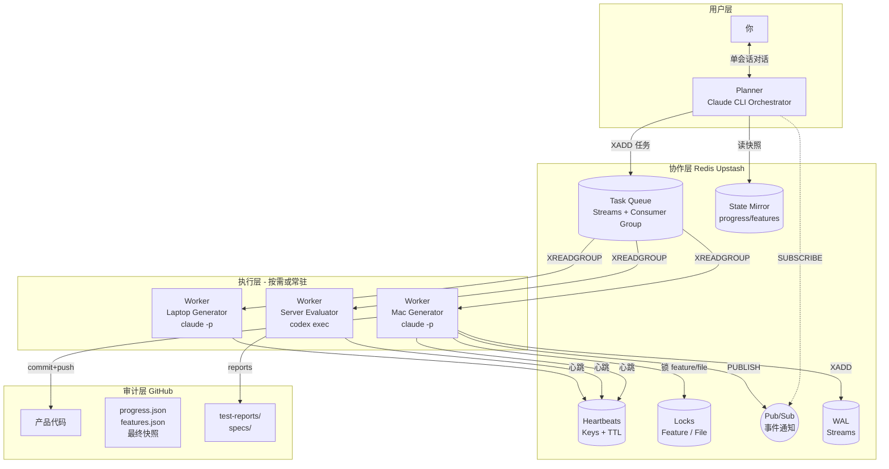
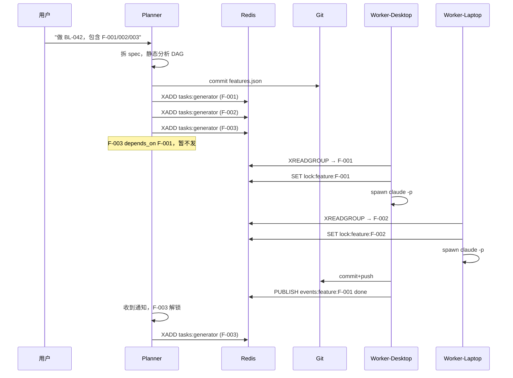
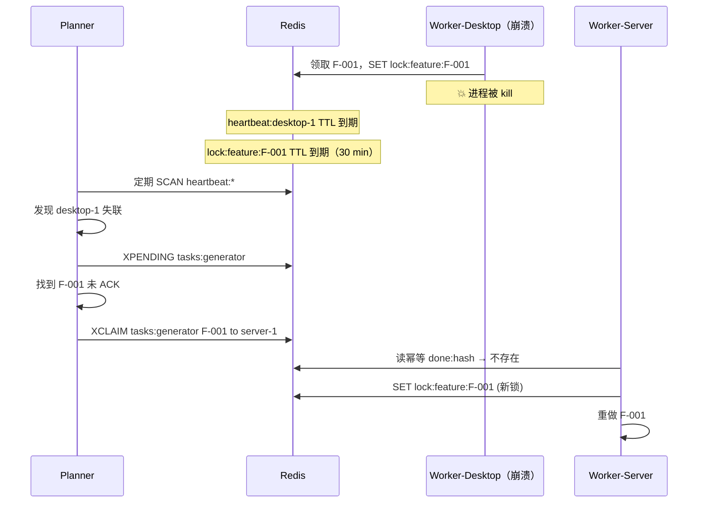
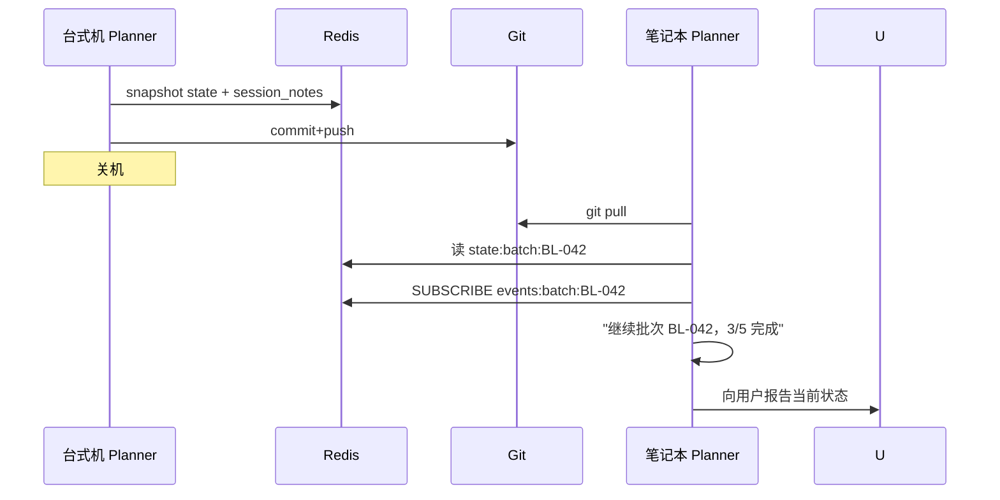

# v1.0 Orchestration Plan — Triad Workflow 分布式编排升级

> **状态：** 设计阶段（等待 Phase 1 启动）
> **版本目标：** v1.0.0
> **预计工期：** 20 周（5 个月）
> **起草日期：** 2026-04-18
> **决策已确认：** 用户 + Claude CLI（本文档）

---

## 0. 背景与目标

### 0.1 为什么要做 v1.0

v0.x 的 Triad Workflow 采用"文件状态机 + Git 总线 + 用户手动调度"模式。现有痛点：

| 痛点 | 现状 | 目标 |
|---|---|---|
| 用户负担 | 手动切换 Planner / Generator / Evaluator 会话 | 用户只和 Planner 对话 |
| 并行能力 | 无，所有 feature 串行执行 | Feature 级并行（多机器同时做不同 feature） |
| 跨机器协作 | 靠 git push/pull 同步，延迟高、无主动通知 | 亚秒级任务派发 + 实时状态通知 |
| 故障恢复 | 人工介入 | 心跳超时自动重分配 |
| 数据一致性 | git 并发写靠 non-fast-forward 拒绝，不可靠 | Redis Streams + CAS，零数据丢失 |

### 0.2 设计原则（v0.x 的核心不变）

- **Generator ≠ Evaluator**（三角色分离依然是铁律）
- **Redis 是运行时 source of truth**（状态、任务、锁、pub/sub 全部走 Redis）
- **Git 是决策点归档 + 代码 + 审计**（里程碑快照，不做实时镜像）
- **降级可用**（Redis 故障时 fall back 到 git-only 单机模式，退化为 v0.x 行为）

### 0.3 决策摘要

| 决策 | 选择 |
|---|---|
| Redis 托管 | **Upstash serverless**（免费额度 10K 请求/天） |
| Worker 启动方式 | **本机 daemon + GitHub Actions 兜底** |
| 并行粒度 | **Feature 级** |
| 冲突检测 | **静态声明 + 动态文件锁兜底** |
| 实现语言 | **Python**（daemon + SDK） |

---

## 1. 架构总览

### 1.1 分层职责



### 1.2 数据流职责划分

| 存储 | 存什么 | 一致性 | 为什么 |
|---|---|---|---|
| **Redis** | 任务队列、心跳、锁、**运行时状态（source of truth）**、WAL | 强一致（单实例） | 低延迟协作 |
| **Git** | 代码、测试报告、specs、progress.json **决策点快照** | 事件驱动归档 | 审计 + 代码分发 + 降级备份 |
| **本机磁盘** | `.agent-id`、`~/.harness/config.yaml` | N/A | agent 身份与连接配置 |

**关键约定**：**Redis 是运行时 source of truth**，所有状态读写都走 Redis。Git 只在关键决策点 snapshot（见 §2.5），形成**语义化审计流**而非"心跳镜像"。Redis 故障时，历史仍可从 git 查阅，只是实时功能停摆。

---

## 2. 核心组件设计

### 2.1 Redis 数据结构

#### 2.1.1 任务队列（Streams + Consumer Group）

```
Stream key: tasks:{role}         # tasks:generator / tasks:evaluator
Consumer Group: workers
Message fields: {
  task_id: "T-{uuid}",
  batch_id: "BL-042",
  feature_id: "F-001",
  executor: "generator",
  payload: { ...spec 引用、prompt 片段... },
  input_hash: "sha256(...)",   # 幂等性 key
  attempt: 1,
  created_at: "2026-04-18T..."
}
```

**操作**：
- Planner: `XADD tasks:generator * ...`
- Worker: `XREADGROUP GROUP workers <agent_id> COUNT 1 BLOCK 5000 STREAMS tasks:generator >`
- 完成: `XACK tasks:generator workers <message_id>`
- 死信: `XPENDING` 检查超时未 ACK 的任务

#### 2.1.2 心跳

```
Key: heartbeat:{agent_id}
Value: JSON { last_seen, current_task_id, machine, role }
TTL: 60s
刷新频率: 每 30s
```

Planner 监控：定期 `SCAN heartbeat:*` 检查 TTL，过期即认为 worker 死亡。

#### 2.1.3 分布式锁

```
Feature lock: lock:feature:{feature_id}
  SET NX EX 1800  (30 分钟)

File lock (动态): lock:file:{sha256(path)}
  SET NX EX 600   (10 分钟)
```

Worker 领取任务后先抢 feature lock，再在修改具体文件前抢 file lock。双层锁防止：
- Feature 级：同一 feature 被多个 worker 同时做
- File 级：不同 feature 的 `touches` 声明漏写时的兜底

#### 2.1.4 运行时状态（Source of Truth）

```
state:batch:{batch_id}       # HSET：status, version, role_assignments, updated_at, last_checkpoint_at
state:feature:{feature_id}   # HSET：status, assigned_worker, touches, started_at
```

Redis 中的 `state:*` 是**运行时 source of truth**。所有 Planner / Worker 的读写都直接走 Redis，不读磁盘 progress.json。Git 中的 progress.json 只在 §2.5 定义的决策点触发归档（不做实时镜像，不走每 5 分钟轮询）。

`version` 是单调递增计数器，所有写入走 Lua 脚本做 CAS：

```lua
if redis.call('HGET', KEYS[1], 'version') == ARGV[1] then
  redis.call('HSET', KEYS[1], 'status', ARGV[2], 'version', ARGV[1]+1)
  return 1
else
  return 0  -- 版本冲突，调用方重试
end
```

#### 2.1.5 Pub/Sub Channels

```
events:batch:{batch_id}      # 批次级事件（planning_done, all_built, signoff）
events:feature:{feature_id}  # feature 级事件（claimed, building, done, failed）
events:worker:{agent_id}     # worker 级事件（joined, heartbeat_lost）
```

Planner SUBSCRIBE 所有相关 channel，实时感知状态变化。

#### 2.1.6 WAL（Write-Ahead Log）

```
Stream: wal:batch:{batch_id}
Each entry: { timestamp, actor, from_state, to_state, feature_id, reason }
```

每次状态转移先 `XADD` 到 WAL，再更新 `state:*`。Planner 重启时可 `XREAD wal:batch:*` 重建状态。

---

### 2.2 Worker 协议

#### 2.2.1 Worker 生命周期（伪代码）

```python
# harness-worker --role generator --agent-id macbook-1
async def worker_loop(role: str, agent_id: str):
    redis = connect_redis()
    heartbeat_task = asyncio.create_task(heartbeat(redis, agent_id))

    try:
        while not shutdown_requested:
            # 1. 拉任务（阻塞 5s）
            msgs = await redis.xreadgroup(
                group="workers",
                consumer=agent_id,
                streams={f"tasks:{role}": ">"},
                count=1,
                block=5000,
            )
            if not msgs:
                continue

            task = parse(msgs)

            # 2. 抢 feature 锁
            got_lock = await redis.set(
                f"lock:feature:{task.feature_id}",
                agent_id, nx=True, ex=1800,
            )
            if not got_lock:
                continue  # 别的 worker 在做，不 ACK，让它超时回流

            # 3. 幂等检查
            if await redis.exists(f"done:{task.input_hash}"):
                await redis.xack(f"tasks:{role}", "workers", task.message_id)
                continue

            # 4. 执行（spawn 子进程）
            try:
                result = await execute(task)  # 调用 claude -p / codex exec
                await commit_and_push(result)
                await redis.setex(f"done:{task.input_hash}", 7*86400, "1")
                await redis.xadd(f"wal:batch:{task.batch_id}", ...)
                await redis.publish(f"events:feature:{task.feature_id}",
                                    json.dumps({"status": "done", ...}))
                await redis.xack(f"tasks:{role}", "workers", task.message_id)
            except Exception as e:
                await handle_error(task, e)  # 重试或升级
            finally:
                await redis.delete(f"lock:feature:{task.feature_id}")
    finally:
        heartbeat_task.cancel()
        await redis.delete(f"heartbeat:{agent_id}")
```

#### 2.2.2 执行函数（核心）

```python
async def execute(task: Task) -> Result:
    if task.executor == "generator":
        # 构建 prompt（从 templates/agent-invocations/generator-prompt.md）
        prompt = render_prompt("generator", task)

        # spawn claude -p 子进程
        proc = await asyncio.create_subprocess_exec(
            "claude", "-p", prompt,
            "--output-format=json",
            cwd=task.project_path,
        )
        stdout, stderr = await proc.communicate()

        # 解析结果 + 验证 commit 已推送
        return parse_claude_output(stdout)

    elif task.executor == "evaluator":
        # spawn codex exec 子进程
        proc = await asyncio.create_subprocess_exec(
            "codex", "exec", "--cd", task.project_path,
            render_prompt("evaluator", task),
        )
        ...
```

**铁律守护**：Worker 代码里硬编码 executor→tool 映射，不允许 Evaluator 调用 `claude -p`，防止破坏"三角色分离"。

#### 2.2.3 两种启动模式

**模式 A：本机 daemon**
```bash
# 台式机启动并持续运行
harness-worker --role generator --agent-id desktop-1 --mode daemon
```

**模式 B：GitHub Actions 兜底**
```yaml
# .github/workflows/harness-worker.yml
on:
  workflow_dispatch:
    inputs:
      role: { required: true }
      batch_id: { required: true }

jobs:
  work:
    runs-on: ubuntu-latest
    steps:
      - uses: actions/checkout@v4
      - run: pip install harness-worker
      - run: harness-worker --role ${{ inputs.role }} --mode one-shot --timeout 30m
        env:
          REDIS_URL: ${{ secrets.REDIS_URL }}
          ANTHROPIC_API_KEY: ${{ secrets.ANTHROPIC_API_KEY }}
```

Planner 触发：
```python
await gh_api.dispatch_workflow(
    repo="tripplemay/aigcgateway",
    workflow="harness-worker.yml",
    inputs={"role": "generator", "batch_id": "BL-042"},
)
```

---

### 2.3 Planner Orchestration Loop

Planner 是一个**长期运行的 Claude CLI 会话**，不是 daemon。它的行为循环：

```
1. 启动/恢复
   - git pull
   - 读 progress.json + Redis state
   - 向用户报告"当前批次 BL-042 在 building，3/5 features 完成"

2. 对话中（用户给需求）
   - 拆解需求 → features.json
   - 静态冲突分析：扫 touches 字段 + depends_on 构建 DAG
   - 找出可并行的 feature 集合 S
   - 批量 XADD 到 tasks:generator

3. 监听（SUBSCRIBE events:*）
   - feature done → 从 DAG 解锁新的 feature → XADD
   - all features built → 切状态到 verifying → XADD 到 tasks:evaluator
   - worker heartbeat lost → 重分配 pending 任务

4. 决策点（主动询问用户）
   - spec 需要确认
   - Evaluator 报告 FAIL → 策略选择（改 spec / 修代码 / 跳过）
   - 同一 feature 重试 3 次仍失败 → 升级

5. 会话结束
   - snapshot Redis → git (progress.json, features.json)
   - commit + push
   - 更新 session_notes
```

**关键约束**：Planner 自己不执行代码任务。即使它有 Bash 工具，所有产品代码修改必须通过 XADD 任务给 Generator Worker。

---

### 2.4 状态机升级

#### 2.4.1 新增状态

```
v0.x: new → planning → building → verifying → fixing → reverifying → done
v1.0: new → planning → dispatching → building → verifying → fixing → reverifying → done
                       ^^^^^^^^^^^
```

`dispatching` 表示 Planner 已写 features.json、正在批量 XADD 任务，但 worker 还没领取。通常只存在几秒，但在 worker 都挂的情况下可能停留更久。

#### 2.4.2 progress.json schema 升级

```json
{
  "version": 42,
  "batch_id": "BL-042",
  "status": "building",
  "role_assignments": {...},
  "last_checkpoint_at": "2026-04-18T10:23:00Z",
  "checkpoint_reason": "dispatching_start",
  "orchestration": {
    "orchestrator_agent": "macbook-planner-1",
    "worker_pool": ["desktop-1", "server-codex-1"],
    "parallel_limit": 3
  },
  "session_notes": {...}
}
```

`version` 字段在 Redis 中强制 CAS；Git snapshot 时同步写入（此时 version 是"归档时刻的版本号"，不保证比 Redis 当前版本新）。`checkpoint_reason` 说明本次归档由哪个事件触发（见 §2.5）。

---

### 2.5 Git 快照触发条件（决策点归档）

Git 中的 `progress.json` / `features.json` 不再做实时镜像，改为**事件驱动的里程碑归档**。只有以下事件触发 snapshot：

| 触发事件 | 归档内容 | 谁执行 | checkpoint_reason |
|---|---|---|---|
| 批次启动（new → planning 完成）| progress.json + features.json + spec 初稿 | Planner | `batch_start` |
| Dispatching 开始（features.json 定稿）| progress.json + features.json | Planner | `dispatching_start` |
| Building 完成（全部 feature done）| progress.json + features.json | Planner | `building_done` |
| 进入 fixing（verifying 失败）| progress.json + evaluator 报告 | Planner | `verify_failed` |
| 进入 reverifying | progress.json + fix 摘要 | Planner | `fix_submitted` |
| 批次完成（done）| progress.json + 全量最终状态 | Planner | `batch_done` |
| 用户介入决策点 | progress.json + 用户决策记录 | Planner | `user_decision` |
| 用户主动 `/snapshot` | 当前完整状态 | Planner | `manual` |

**commit message 格式**（语义化 + 可 grep）：

```
state(BL-042): planning → dispatching — 5 features defined
state(BL-042): building → verifying — 5/5 features done
state(BL-042): verifying → fixing (round 2) — F-003 failed edge case
state(BL-042): reverifying → done — all pass, 2 fix rounds
```

**效果**：`git log --grep "state(BL-042)"` 直接讲出批次的完整故事，不需要翻数据库或 WAL。

**不触发 snapshot 的情况**（这些只在 Redis 里）：
- Worker 心跳更新
- 单个 feature 的 claimed / building 状态流转
- 锁的获取/释放
- 任务 attempt 计数递增
- session_notes 的中间更新

**归档开销估算**：典型 5-feature 批次约产生 6-10 次 git commit（而非每 5 分钟 1 次 ≈ 数十次），commit 历史更可读。

---

## 3. 关键场景数据流

### 3.1 场景：启动新批次并派发 3 个 feature



### 3.2 场景：Worker 崩溃后自动恢复



### 3.3 场景：笔记本接管台式机会话



无需特殊 handoff 协议——Planner 本身无状态，所有状态在 Redis+Git。

---

## 4. Phase-by-Phase 技术任务

### Phase 1: Level 2 单机 MVP（4 周）
**目标**：Planner spawn 子进程，单机跑通批次。不引入 Redis。

| Week | 产物 |
|---|---|
| 1 | `harness/orchestrator.md`、`templates/agent-invocations/{generator,evaluator}-prompt.md` |
| 2 | Planner 的 Bash 调用封装（shell wrapper），`dispatching` 状态加入 harness-rules.md |
| 3 | 单机 smoke test：空批次编排、单 feature 批次 |
| 4 | 在 aigcgateway 跑真实 5-feature 批次 |

**里程碑**：用户只和 Planner 对话，完成批次。

### Phase 2: Redis 基础设施（2 周）
**目标**：搭 Upstash + Python SDK，替换 Phase 1 的 git 任务队列。

| Week | 产物 |
|---|---|
| 5 | Upstash 实例 + `harness-sdk` Python 包（TaskQueue/Heartbeat/Lock/PubSub/WAL 封装） |
| 6 | Planner 改用 Redis 队列，单机仍能跑通 |

**里程碑**：单机跑通但底层是 Redis。

### Phase 3: 远程 Worker（4 周）
**目标**：跨机器能力上线。

| Week | 产物 |
|---|---|
| 7 | `harness-worker` daemon（Python CLI）|
| 8 | `.github/workflows/harness-worker.yml` + Planner 触发能力 |
| 9 | 跨机器测试：台式机 + 云服务器 |
| 10 | aigcgateway 混合模式批次 |

**里程碑**：Generator 在机器 A、Evaluator 在机器 B 跑通批次。

### Phase 4: 并行多 Generator（3 周）
**目标**：Feature 级并行，静态+动态冲突检测。

| Week | 产物 |
|---|---|
| 11 | `features.json` schema 升级（touches + depends_on），Planner DAG 调度算法 |
| 12 | Worker 级文件锁兜底 |
| 13 | 并行压测：2 worker × 3 feature，验证无冲突 |

**里程碑**：并行实际加速 1.5x 以上。

### Phase 5: 零数据丢失 + 故障恢复（4 周）
**目标**：at-least-once + 幂等 + 心跳重分配 + WAL。

| Week | 产物 |
|---|---|
| 14 | Consumer group pending list 监控 + XCLAIM 重分配 |
| 15 | Worker 幂等化（input_hash + done key） |
| 16 | WAL 实现 + Planner 启动时从 WAL 重建状态 |
| 17 | 故障注入测试：kill worker / planner，系统自动恢复 |

**里程碑**：随机 kill 任意组件，批次最终正确完成。

### Phase 6: UX + v1.0 发布（3 周）
**目标**：会话接管、操作指令、文档、发布。

| Week | 产物 |
|---|---|
| 18 | `/pause` `/resume` `/status` `/handoff` 指令，Planner 定期进度汇报 |
| 19 | bootstrap 脚本升级（Redis 配置引导），CHANGELOG + MIGRATION.md |
| 20 | aigcgateway v1.0 验证 + GitHub release + tag v1.0.0 |

**里程碑**：v1.0.0 tag + 两份 dogfooding 报告。

---

## 5. 风险与降级策略

### 5.1 Redis 不可达
- Planner 检测连接失败 → 切换到 **git-only degraded mode**（退化为 v0.x 单机行为）
- Worker 停止消费，优雅退出
- 降级模式下：Planner 从最后一次 git snapshot（§2.5）重建本地状态视图，用户可继续单机操作（无并行、无实时通知、无任务队列、无心跳）
- Redis 恢复后：Planner 把 git snapshot state 回填到 Redis `state:*` → 恢复正常模式
- **历史可追溯**：即使 Redis 长期故障，`git log --grep "state(BL-XXX)"` 仍包含完整批次语义（§2.5 的里程碑 commit）

### 5.2 Worker 冻结
- 心跳 TTL = 60s
- Planner 每 30s 扫一次 `heartbeat:*`
- 检测到失联 → `XPENDING` + `XCLAIM` 重分配
- 重分配前先检查 `done:*` 防止重复执行

### 5.3 Planner 崩溃
- 用户重开 CLI 会话即可
- 启动时读 `state:*` + `wal:*` 恢复上下文
- 用户可见：会话中断，但一次 `/status` 即可继续

### 5.4 并行冲突漏检
- 静态声明漏了 `touches` → 动态文件锁兜底
- 两层都漏 → Evaluator 会发现测试失败 → 进入 fixing 循环
- 多次 fix 仍失败 → 升级给用户

### 5.5 Upstash 免费额度超限
- 监控：`harness-sdk` 打点请求数
- 超过 8K/天 → Planner 主动告警
- 升级到付费（$10/月起）或自建 Redis

---

## 6. 技术决策（已确认 2026-04-18）

Phase 1 启动前的 5 个关键问题已由用户确认。

| # | 问题 | 决策 | 实施细节 |
|---|---|---|---|
| 1 | `harness-worker` 包分发方式 | 先 GitHub，v1.0 推 PyPI | 开发期用 `pip install git+https://github.com/tripplemay/harness-template@main#subdirectory=worker`；v1.0.0 发布时抢占 PyPI 名字 `harness-worker` |
| 2 | Python 环境管理工具 | **uv** | 标准 `pyproject.toml` + `uv.lock`；`uv sync` / `uv run`；CI 也用 uv |
| 3 | Worker 长时任务（> 30 min）锁策略 | **Heartbeat 续锁** | Worker daemon 内部每 10 分钟 `EXPIRE lock:feature:<id> 1800` 续期；心跳线程崩溃即锁自然过期（最多等 20 分钟释放） |
| 4 | 多 Planner 并发保护 | **Phase 1-5 简单拒绝，Phase 6 加 Leader 选举** | Phase 1-5：启动时检测 `leader:orchestrator` key 存在则报错退出；Phase 6：`SETNX leader:orchestrator <agent> EX 60` + 每 30s 续期，失败则进入 observer 模式（可查状态不可派发） |
| 5 | Claude API 成本控制 | **SDK 内置 budget 监控** | `~/.harness/config.yaml` 设 `daily_budget_usd: 20`；Worker 完成任务后上报 tokens，Planner 累计到 `budget:daily:{YYYY-MM-DD}`；超限 `PUBLISH events:budget exceeded`，所有 Worker 停止消费直到次日或手动 `/budget reset` |

**决策过程记录参见 §9 变更记录。**

---

## 7. 与 v0.x 的兼容性

- **向前兼容**：v0.x 的 `progress.json` schema 完全保留，v1.0 只**新增**字段（`last_checkpoint_at` / `checkpoint_reason` / `orchestration`），去掉了未曾发布的 `redis_mirror` 中间方案
- **降级能力**：v1.0 可以在"git-only degraded mode"下退化为 v0.x 行为
- **用户迁移**：`bootstrap-upgrade.sh v0.9 → v1.0` 脚本引导配置 Upstash 连接
- **aigcgateway 作为 reference**：每个 Phase 都在 aigcgateway dogfooding 后才合入 harness-template

---

## 8. 下一步

1. ✅ 本文档（已完成）
2. ⏭️ **Phase 1 启动**：需要用户确认 → 进入 batch planning
   - 拆 Phase 1 为 4-6 个 feature
   - 写 `harness/orchestrator.md` 初稿
   - 搭建 smoke test 环境
3. 后续每个 Phase 结束都产出：
   - CHANGELOG 条目
   - aigcgateway dogfooding 报告
   - 下一 Phase 的 feature list

---

**本文档是活文档。每个 Phase 结束时回头修订。重大架构决策变更必须在此文档增补变更记录，并保留原决策作为追溯。**

---

## 9. 变更记录

### 2026-04-18 · 采纳方案 B：文件降级为里程碑快照
**背景：** 用户质疑"既然引入 Redis，为什么还保留文件状态机？为什么不用数据库？"

**原方案（v0 草稿）：** Redis 作运行时状态 + 每 5 分钟 snapshot 到 Git（双层镜像）。存在双写成本、不一致窗口、`redis_mirror.dirty_since` 同步字段复杂。

**新方案：** Redis 是运行时 source of truth，Git 只做**事件驱动的里程碑快照**（§2.5 定义 8 种触发条件）。

**影响的章节：** §0.2 / §1.2 / §2.1.4 / §2.4.2 / 新增 §2.5 / §5.1 / §7

**未采纳的备选方案：**
- **方案 A**（双层镜像）：保持原 plan，架构复杂度高
- **方案 C**（纯 Postgres）：架构最干净，但引入 PG 依赖、失去"代码+状态原子快照"、开源门槛高

**保留空间升级到 C：** 未来若项目扩展到多人团队 / 跨项目 dashboard / 复杂查询报表，可在 v2.0 评估升级到 Postgres。v1.0 的 `state:*` Redis 数据结构与 PG schema 可一一映射，迁移成本可控。

---

### 2026-04-18 · 5 项技术决策确认

用户确认 §6 的 5 个开放问题。详细选择和理由见 §6 表格。摘要：

- 分发：先 GitHub → v1.0 推 PyPI
- Python 环境：uv
- 长任务锁：Heartbeat 续锁
- 多 Planner：Phase 1-5 简单拒绝 + Phase 6 Leader 选举
- 成本控制：SDK 内置 budget 监控（默认 $20/天）

这些决策将进入 Phase 1 和 Phase 2 的 feature 拆分。

---

### 2026-04-19 · Phase 1 代码实现完成（dogfooding 待办）

**已交付产出（P1-01 至 P1-07）：**

| 产物 | 位置 | 行数 |
|---|---|---|
| Orchestrator 角色指令 | `harness/orchestrator.md` | 297 |
| Generator prompt 模板 | `templates/agent-invocations/generator-prompt.md` | 126 |
| Evaluator prompt 模板 | `templates/agent-invocations/evaluator-prompt.md` | 135 |
| 状态机规则升级 | `harness/harness-rules.md`（4 处 edit，新增 dispatching + 2 条铁律） | +31 |
| 子进程调度器 | `scripts/dispatch.py`（render / run / parse 三命令） | 215 |
| Smoke test 脚本 | `scripts/smoke-test.sh`（2 个场景，全通过） | 170 |

**Smoke test 验证结果（本地运行通过）：**
- Test 1：空批次 3 个语义化 state commits（`state(BL-EMPTY): ... → ... — <reason>`），`git log --grep` 能讲出批次故事 ✓
- Test 2：渲染 + 运行（mock claude 子进程）+ 解析 JSON，4 个模板变量正确替换，工具隔离检查通过 ✓

**设计决策沉淀：**
- 模板引擎用最简 `{{var}}` 正则替换，无循环/条件（保持新人可读性）
- 子进程输出契约：stdout 最后一行必须合法 JSON，便于 `tail -1 + python/jq` 解析
- 工具隔离在脚本层硬编码（`generator→claude -p` / `evaluator→codex exec`），守护"Generator ≠ Evaluator"铁律
- Phase 1 明确声明"单机串行、无 Redis、无心跳、无 budget"，避免和后续 Phase 的能力混淆

**尚未完成（P1-08 / P1-09）：**

> **P1-08 aigcgateway dogfooding 必须在 `tripplemay/aigcgateway` repo 实际运行一个 5-feature 批次，本 repo 的 Claude CLI 会话不能替代。** 需要用户切换到 aigcgateway 项目：
> 1. 在 aigcgateway 的 `progress.json` 加入 `orchestration` 字段启用 Orchestrator 模式
> 2. 跑一个真实批次，对照 Phase 1 目标验证：用户只和 Planner 对话、dispatching 状态正常流转、subprocess 派发工作
> 3. 记录发现的问题、用户操作次数对比 v0.x、token 消耗

> **P1-09 Phase 1 回顾**（含 CHANGELOG v1.0.0-phase1 条目）在 P1-08 完成后才能写，因为需要 dogfooding 数据。
